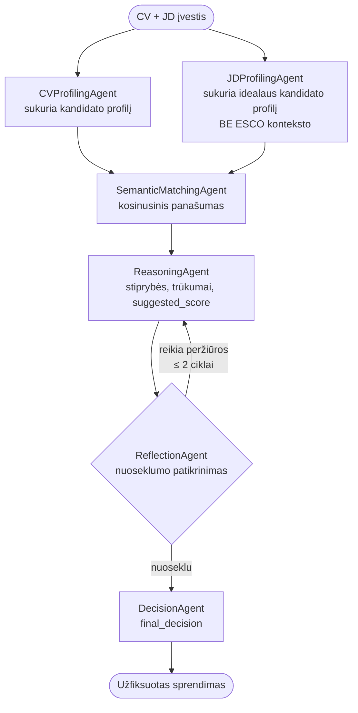
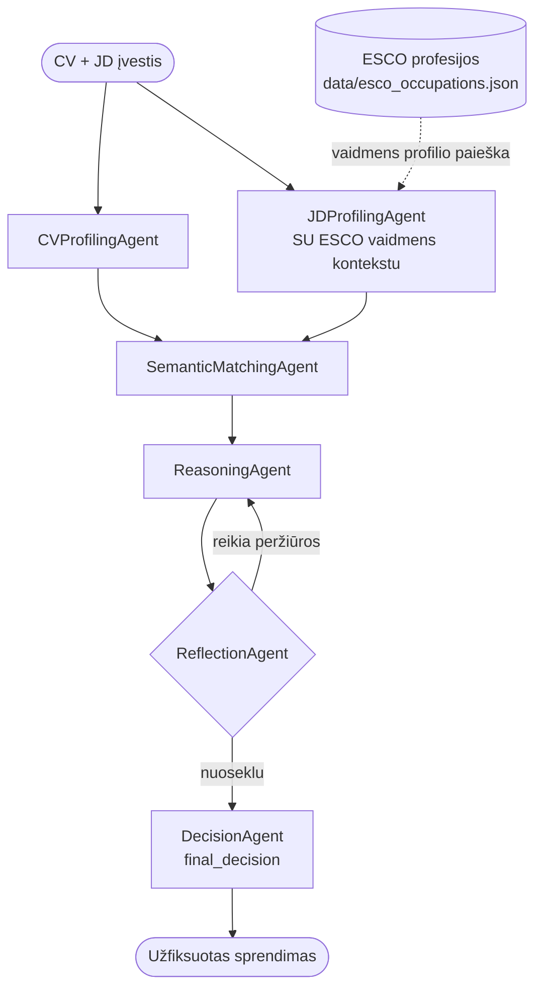
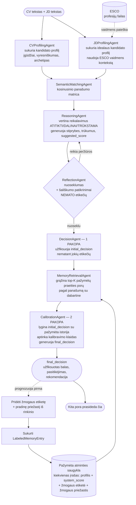
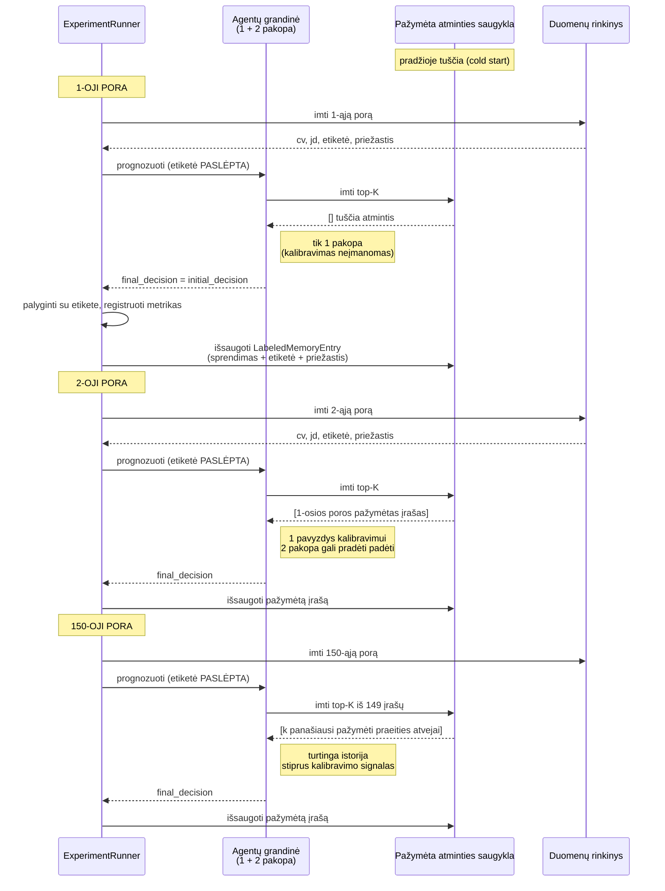
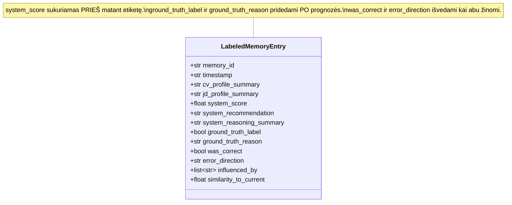
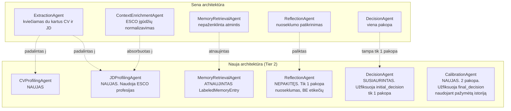
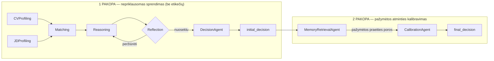

# Naujos architektūros diagramos — Tier 2 perprojektavimas

Šis failas turi visas perprojektuotos sistemos diagramas: padalintus CV/JD profiliavimo agentus, pašalintą papildomos kontekstinės informacijos agentą, pridėtą dvipakopį sprendimą su atminties banko kalibravimu ir grynai online (per srautą) vykdomą vertinimą.

---

## Kaip žiūrėti šį failą kaip realias diagramas

Žemiau pateiktos diagramos parašytos Mermaid sintakse. Jos vizualiai atvaizduojamos:

- **VS Code** — įmontuotas Markdown peržiūros režimas (Ctrl+Shift+V) naujesnėse versijose atvaizduoja Mermaid. Jei jūsiškis neatvaizduoja, įdiekite plėtinį *„Markdown Preview Mermaid Support"* (autorius Matt Bierner).
- **GitHub** — įkėlus failą ir atvėrus github.com, Mermaid atvaizduojama natūraliai.
- **Obsidian, Typora, MarkText** — visi atvaizduoja Mermaid natūraliai.
- **Online** — bet kurį atskirą ` ```mermaid ... ``` ` bloką galima įklijuoti į <https://mermaid.live> greitam peržiūrai.

Jei matote kodo blokus vietoj diagramų, jūsų peržiūros įrankis Mermaid nepalaiko. Greičiausias sprendimas Windows aplinkoje — VS Code įmontuotas peržiūros režimas su minėtu plėtiniu.

---

## Kas keičiasi

| Komponentas | Statusas | Detalė |
|---|---|---|
| `ExtractionAgent` (viena klasė, vykdoma du kartus) | **PAŠALINTAS** | Pakeistas dviem specializuotais agentais |
| `CVProfilingAgent` | **NAUJAS** | Sukuria kandidato profilį iš CV |
| `JDProfilingAgent` | **NAUJAS** | Sukuria idealaus kandidato profilį iš JD su ESCO profesijos kontekstu |
| `ContextEnrichmentAgent` | **PAŠALINTAS** | Įgūdžių normalizavimas absorbuotas į abu profiliavimo agentus |
| `SemanticMatchingAgent` | nepakitęs | Vis dar skaičiuoja kosinusinį panašumą |
| `ReasoningAgent` | nepakitęs | Vis dar generuoja stiprybes/trūkumus/`suggested_score` |
| `ReflectionAgent` | vaidmuo nepakitęs | Tik 1-osios pakopos nuoseklumo patikrinimas — NEMATO etikečių |
| `DecisionAgent` | vaidmuo susiaurintas | Dabar generuoja tik **`initial_decision`** (1-oji pakopa) |
| `MemoryRetrievalAgent` | **ATNAUJINTAS** | Dabar grąžina `LabeledMemoryEntry` vietoj nepaženklintos atminties |
| `CalibrationAgent` | **NAUJAS** | 2-oji pakopa — peržiūri `initial_decision` palyginant su etikečių istorija, generuoja `final_decision` |
| Atminties įrašo formatas | **ATNAUJINTAS** | `MemoryEntry` → `LabeledMemoryEntry` su `ground_truth_label` + `ground_truth_reason` |
| Vertinimo protokolas | **NAUJAS** | Grynai online per srautą: pirma prognozuoja → prideda etiketę → išsaugo → kita pora |

---

## 1 diagrama: Scenarijus A (bazinis, be vaidmens konteksto, be atminties)



---

## 2 diagrama: Scenarijus B (A + ESCO vaidmens kontekstas JD profiliavime)



---

## 3 diagrama: Scenarijus C — pilna detalė (naujasis srautas)

Tai labiausiai pakeistas scenarijus ir tezės palyginimo centras. Jis naudoja ESCO vaidmens kontekstą IR pažymėtą atmintį + dvipakopį kalibravimą.



### Pagrindinės C scenarijaus savybės

1. **Dvipakopis sprendimas**: 1 pakopa (Reasoning + Reflection + DecisionAgent) užfiksuoja `initial_decision` nematant jokių etikečių. 2 pakopa (MemoryRetrieval + CalibrationAgent) peržiūri `initial_decision` palyginant su pažymėta istorija ir užfiksuoja `final_decision`.
2. **Etikečių nutekėjimo prevencija**: 1 pakopoje sistema nemato nieko apie tikrąją etiketę. Etiketė pridedama tik PO TO, kai `final_decision` jau užfiksuotas.
3. **Cold-start (grynai online)**: atmintis pradžioje tuščia. 1-oji pora turi nulį pažymėtos istorijos; 150-oji — 149 įrašus.
4. **Refleksija ir kalibravimas — skirtingi mechanizmai**: Refleksija tikrina vidinį nuoseklumą (be etikečių). Kalibravimas naudoja išorinį pažymėtą grįžtamąjį ryšį (su etiketėmis). Švarus atskyrimas.

---

## 4 diagrama: Srauto vertinimo protokolas laike



Tai yra **StreamBench protokolas** (Yehudai et al. 2025 §3 — nuolatinis tobulinimas iš srauto duomenų su grįžtamuoju ryšiu). Sistema niekada nemokoma pažymėtais duomenimis — kiekviena prognozė užfiksuojama prieš atskleidžiant jos etiketę. Praeities porų etiketės tampa kontekstine medžiaga tolesnėms poroms.

---

## 5 diagrama: `LabeledMemoryEntry` struktūra



### Laukų semantika

| Laukas | Kada nustatomas | Šaltinis |
|---|---|---|
| `memory_id` | Sukūrimo metu | UUID, generuojamas runner'io |
| `cv_profile_summary` | Sukūrimo metu | Iš `CandidateProfile.raw_summary` |
| `jd_profile_summary` | Sukūrimo metu | Iš `IdealCandidateProfile.raw_summary` |
| `system_score` | Po 2 pakopos užfiksuoto `final_decision` | Iš `final_decision.score` |
| `system_recommendation` | Po 2 pakopos | Iš `final_decision.recommendation` |
| `system_reasoning_summary` | Po 2 pakopos | Iš `reasoning_output.overall_assessment` |
| `ground_truth_label` | Po prognozės užfiksavimo | Iš rinkinio (`Decision` laukas) |
| `ground_truth_reason` | Po prognozės | Iš rinkinio (`Reason_for_decision` laukas) |
| `was_correct` | Išvedamas | `(system_score >= riba) == ground_truth_label` |
| `error_direction` | Išvedamas | Vienas iš {TP, FP, TN, FN} |
| `influenced_by` | Po 2 pakopos | Sąrašas `memory_id`, paimtų šios poros 2 pakopos metu |
| `similarity_to_current` | Paėmimo metu | Nustatomas, kai šis įrašas paimamas tolesnei porai |

---

## 6 diagrama: Kas pašalinta, palikta ir pridėta



---

## 7 diagrama: 1 pakopa vs 2 pakopa — atskyrimas



### Kodėl dvi pakopos (o ne vienas didelis agentas, kuris mato viską)

- **Švaresnė ablacija**: galime pranešti `initial_decision` IR `final_decision` kiekvienai porai. Delta = tiesioginis matavimas, ar pažymėta atmintis padėjo šioje poroje.
- **Švaresnis priskyrimas**: 1 pakopos rezultatai tiesiogiai palyginami tarp visų trijų scenarijų. Scenarijaus A 1 pakopa == galutinis A. Scenarijaus C 1 pakopa == „ką C būtų padaręs be atminties". Tai izoliuoja atminties indėlį.
- **Švaresnė tezės istorija**: „agentas pirma sprendžia pats, paskui apmąsto pažymėtą istoriją ir peržiūri." Atspindi žmogaus pažinimą.
- **Švaresnė metodologija**: „vidinio samprotavimo" (1 pakopa) atskyrimas nuo „išorinio grįžtamojo ryšio" (2 pakopa) yra pripažintas agentų dizaino šablonas literatūroje.

---

## 8 diagrama: Visi trys scenarijai vienoje drobėje (aukšto lygio palyginimas)

```mermaid
flowchart TB
    subgraph A["SCENARIJUS A"]
        A1[CVProfiling] --> A3[Matching]
        A2[JDProfiling be ESCO] --> A3
        A3 --> A4[Reasoning + Reflection kilpa]
        A4 --> A5[DecisionAgent]
        A5 --> A6([final])
    end

    subgraph B["SCENARIJUS B"]
        B1[CVProfiling] --> B3[Matching]
        B2[JDProfiling + ESCO] --> B3
        ESCOB[(ESCO)] -. vaidmuo .-> B2
        B3 --> B4[Reasoning + Reflection kilpa]
        B4 --> B5[DecisionAgent]
        B5 --> B6([final])
    end

    subgraph C["SCENARIJUS C"]
        C1[CVProfiling] --> C3[Matching]
        C2[JDProfiling + ESCO] --> C3
        ESCOC[(ESCO)] -. vaidmuo .-> C2
        C3 --> C4[Reasoning + Reflection kilpa]
        C4 --> C5[DecisionAgent — 1 pakopa]
        C5 --> C6[MemoryRetrieval]
        MemC[(Pažymėta atmintis)] --> C6
        C6 --> C7[CalibrationAgent — 2 pakopa]
        C7 --> C8([final])
        C8 -. pridėti etiketę, išsaugoti .-> MemC
    end
```



Tai daro eksperimentinį kontrastą aiškų:

- **A vs B** matuoja ESCO vaidmens konteksto indėlį.
- **B vs C 1 pakopa** yra niekinis veiksmas (1 pakopa identiška tarp B ir C).
- **C 1 pakopa vs C 2 pakopa** matuoja pažymėtos atminties kalibravimo indėlį.
- **A vs C final** matuoja bendrą vaidmens konteksto + pažymėtos atminties indėlį.

---

## Patvirtinti dizaino sprendimai

| Sprendimas | Pasirinkimas |
|---|---|
| Padalinti ekstrakciją į CVProfiling + JDProfiling | ✅ patvirtinta |
| Pašalinti `ContextEnrichmentAgent` | ✅ patvirtinta (darbas absorbuotas į JDProfilingAgent) |
| Dvipakopis sprendimas (initial + kalibruotas) | ✅ patvirtinta |
| Atminties formatas: saugoti sprendimą + tikrąją etiketę + priežastį | ✅ patvirtinta (LabeledMemoryEntry) |
| Srauto protokolas: pirma prognozuoti, paskui pridėti etiketę ir išsaugoti | ✅ patvirtinta |
| Cold-start atmintis (tuščia vertinimo pradžioje, grynai online) | ✅ patvirtinta |
