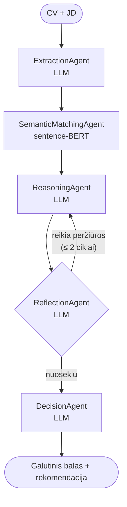
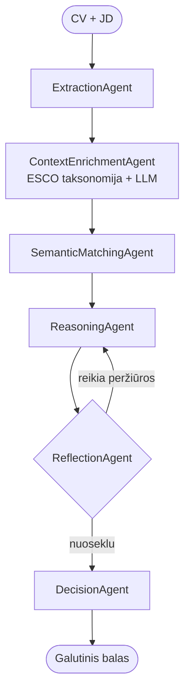
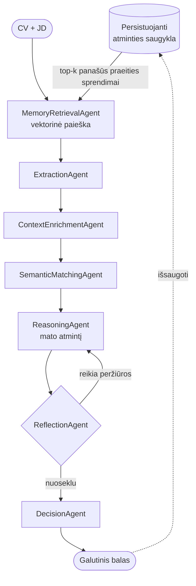

# Daugiaagentė CV–JD atitikimo sistema — pilnas apžvalginis vadovas

*Pasitarimui paruoštas dokumentas, apimantis architektūrą, scenarijus, vertinimą ir esamus rezultatus.*

> **Pastaba:** šis dokumentas atspindi ankstyvąjį projekto etapą (Tier 1, 7 agentai, 151 poros pilotas). Naujausia architektūra (Tier 2, 8 agentai, 5 000 porų pagrindinis eksperimentas) aprašyta `architecture.md` faile ir bakalauro darbe.

---

## 1. Kas yra projektas

**Daugiaagentė sistema**, sukurta ant didžiojo kalbos modelio pagrindo, kuri sprendžia, ar konkretus CV (gyvenimo aprašymas) atitinka konkretų darbo skelbimą (JD). Kiekvienai porai sistema generuoja:

- Balą nuo 0 iki 100
- Pasitikėjimo lygį
- Kategorinę rekomendaciją (`strong_match` / `good_match` / `partial_match` / `weak_match` / `no_match`)
- Struktūrinį paaiškinimą: stiprybių, trūkumų, abejonių ir esminių veiksnių sąrašus

Pagrindinis tyrimo klausimas:
> Ar daugiaagentė architektūra įveikia paprastą semantinio panašumo lyginamąjį pagrindą atskiriant atitinkančias nuo neatitinkančių CV–JD poras?

Lyginame tris vis sudėtingesnius scenarijus (A, B, C) ir tik embedding'ų lyginamąjį pagrindą.

---

## 2. Kodėl daugiaagentė, o ne grandinė

Naivus sprendimas būtų: išgauti įgūdžius → skaičiuoti panašumą → taikyti ribą → baigta. Tai *grandinė*: fiksuota etapų seka, kurioje kiekvienas etapas perduoda savo pirmtako išvestį.

Ši sistema yra kitokia. Tai **daugiaagentė sistema su lenta (blackboard)**. Savybės, kurios ją skiria nuo grandinės:

| Savybė | Grandinė | Ši sistema |
|---|---|---|
| Būsenos dalijimasis | Kiekvienas etapas mato tik pirmtako išvestį | Visi agentai skaito ir rašo bendrą lentą (`SharedContext`) |
| Srauto valdymas | Fiksuota seka | Gali grąžinti ankstesnius agentus pagal vėlesnių agentų sprendimus (refleksijos kilpa) |
| Kompozicija | Viena fiksuota seka | Agentų grandinė priklauso nuo scenarijaus (A, B, C) |
| Maršrutizacija | Deterministinė | Refleksijos agentas savarankiškai sprendžia, ar samprotavimas pakankamai geras |
| Grįžtamasis ryšys | Vienakryptis | Refleksijos grįžtamasis ryšys grįžta į samprotavimą |

Šis pristatymas grindžiamas publikuota literatūra (žr. 11 skyrių).

---

## 3. Sistemos architektūra

### 3.1 Lentos šablonas

Visi agentai bendrauja skaitydami ir rašydami vieną bendrą objektą, vadinamą `SharedContext`. Pagalvokite apie tai kaip apie baltą lentą posėdžių kambaryje: kiekvienas agentas prieina, įrašo savo radinius, ir bet kuris vėlesnis agentas gali perskaityti viską, kas jau yra lentoje.

```
+----------------------------------------------------------+
|                 SharedContext (lenta)                    |
|                                                          |
|  cv_text, jd_text, scenario                              |
|  cv_entities, jd_entities          (← ExtractionAgent)   |
|  normalized_entities               (← EnrichmentAgent)   |
|  similarity_scores                 (← MatchingAgent)     |
|  memory_entries                    (← MemoryAgent)       |
|  reasoning_output                  (← ReasoningAgent)    |
|  reflection_output, needs_revision (← ReflectionAgent)   |
|  final_decision                    (← DecisionAgent)     |
|  logs[], agent_token_usage         (← visi agentai)      |
+----------------------------------------------------------+
```

### 3.2 Septyni agentai

| Agentas | Naudoja LLM? | Įvestis | Išvestis | Vaidmuo |
|---|---|---|---|---|
| **MemoryRetrievalAgent** | Ne (vektorinė paieška) | cv_text, jd_text | `memory_entries` | Ieško panašių praeities sprendimų |
| **ExtractionAgent** | Taip | cv_text, jd_text | `cv_entities`, `jd_entities` | Išgauna įgūdžius, patirtį, išsilavinimą |
| **EnrichmentAgent** | Taip + ESCO taksonomija | cv_entities, jd_entities | `normalized_entities` | Normalizuoja įgūdžius pagal taksonomiją |
| **SemanticMatchingAgent** | Ne (sentence-BERT) | įgūdžių sąrašai | `similarity_scores` | Skaičiuoja kosinusinio panašumo matricą |
| **ReasoningAgent** | Taip | visa lenta | `reasoning_output` | Generuoja stiprybes, trūkumus, siūlomą balą |
| **ReflectionAgent** | Taip | reasoning_output + duomenys | `reflection_output` | Peržiūri samprotavimo kokybę |
| **DecisionAgent** | Taip | visa lenta | `final_decision` | Galutinis balas, pasitikėjimas, rekomendacija |

Kiekvienas agentas paveldi iš `BaseAgent`, kuris suteikia laiko matavimą, žurnalizaciją ir žetonų naudojimo sekimą.

### 3.3 Orkestratorius

`Orchestrator` yra vienintelis komponentas, žinantis, kuriuos agentus kviesti ir kokia tvarka. Svarbu — orkestratoriaus logika **nėra fiksuota grandinė** — ji apima:
- Sąlyginį agentų įtraukimą pagal scenarijų
- Ribotą refleksijos kilpą (iki 2 peržiūrų), kuri gali pakartotinai vykdyti `ReasoningAgent`
- Atminties išsaugojimą po scenarijaus C vykdymo

---

## 4. Trys scenarijai

### 4.1 Scenarijus A — bazinis daugiaagentis atitikimas



**Ką testuoja**: daugiaagenčio samprotavimo + refleksijos vertę virš žalio embedding panašumo.

### 4.2 Scenarijus B — A + ESCO papildymas



**Ką prideda**: įgūdžiai normalizuojami pagal ESCO Europos įgūdžių taksonomiją. „ML" ir „Machine Learning" tampa tuo pačiu kanoniniu pavidalu. JD reikalavimas „5+ metų Python" sugretinamas su kandidato „5 metų Python kūrimas".

**Ką testuoja**: ar išorinės struktūruotos žinios (ESCO) pagerina atitikimą.

### 4.3 Scenarijus C — B + praeities sprendimų atmintis



**Ką prideda**: prieš samprotavimą sistema iš persistuojančios vektorinės saugyklos grąžina 3 panašiausius praeities sprendimus ir juos įterpia į `ReasoningAgent` promptą kaip kontekstą. Po sprendimo naujas sprendimas pridedamas į saugyklą.

**Ką testuoja**: ar mokymasis iš sukauptos patirties pagerina atitikimą — centrinė atminties hipotezė.

### 4.4 Palyginimo santrauka

| Komponentas | Baseline | A | B | C |
|---|---|---|---|---|
| Sentence-BERT panašumas | ✓ | ✓ | ✓ | ✓ |
| ExtractionAgent (LLM) | | ✓ | ✓ | ✓ |
| ESCO papildymas | | | ✓ | ✓ |
| Atminties paieška | | | | ✓ |
| ReasoningAgent | | ✓ | ✓ | ✓ |
| ReflectionAgent + peržiūros kilpa | | ✓ | ✓ | ✓ |
| DecisionAgent | | ✓ | ✓ | ✓ |
| Kaina porai | ~$0.0001 | ~$0.002 | ~$0.0023 | ~$0.0025 |
| Laikas porai | ~1 s | ~30 s | ~36 s | ~38 s |

---

## 5. Refleksijos kilpa (išskirtinis bruožas)

Po to, kai `ReasoningAgent` generuoja stiprybes, trūkumus ir siūlomą balą, **`ReflectionAgent`** nepriklausomai peržiūri šią išvestį. Jis tikrina:

1. Ar stiprybės pagrįstos įrodymais iš CV?
2. Ar trūkumai realūs, ar samprotavimas neklasifikavo padengtų reikalavimų kaip trūkstamų?
3. Ar balas pateisinamas stiprybių vs trūkumų pusiausvyra?
4. Ar samprotavimas per dosnus ar per griežtas?
5. Ar yra šališkumo požymių (pozicijos paklaida, ilgio paklaida)?

Jei refleksijos verdiktas yra `is_consistent=False`, orkestratorius:

1. Padidina `revision_count += 1`
2. Pakartotinai vykdo `ReasoningAgent` su refleksijos `issues_found` ir `suggestions`, įterptais į vartotojo promptą
3. Pakartotinai vykdo `ReflectionAgent` ant naujos išvesties
4. Sustoja kai refleksija sako „nuoseklu" ARBA pasiekiama `max_revisions = 2`

```
ReasoningAgent  →  ReflectionAgent
      ↑                  ↓
      └── grįžtamoji ────┘  (iki 2 ciklų)
          kilpa
```

Štai kodėl sistema yra **agentinė, ne grandinė**: `ReflectionAgent` savarankiškai sprendžia, ar ankstesnio agento darbas priimtinas, ir jo sprendimas valdo orkestratoriaus vykdymo kelią.

---

## 6. Atminties architektūra (Scenarijus C)

### 6.1 Kas saugoma

Kiekvienas `MemoryEntry` turi:
- `memory_id` (uuid)
- `cv_summary`, `jd_summary` (išgautos santraukos)
- `decision_score` (0–100 iš praeities vykdymo)
- `reasoning_summary` (praeities vykdymo `overall_assessment`)
- `timestamp`
- `influenced_by` (memory_ids praeities sprendimų, kurie suformavo ŠĮ sprendimą — loginės priklausomybės grandinė)

**Svarbu**: tikrosios etiketės **niekada** nesaugomos. Atmintis turi tik sistemos pačios praeities sprendimus, niekada rinkinio teisingų atsakymų. Tai patikrinta kode.

### 6.2 Kaip veikia paieška

Naujai CV-JD porai:
1. Sukonkatenuoja cv_text + jd_text ir koduoja su sentence-BERT.
2. Skaičiuoja kosinusinį panašumą su visais saugomais embedding'ais.
3. Taiko **šviežumo svorį**: senesni atminties įrašai gauna iki 15 % panašumo nuobaudą (linijinis mažėjimas, seniausi = 0,85, naujausi = 1,0).
4. Taiko **dedubliavimą pridėjimo metu**: jei naujas atminties įrašas yra >0,95 panašus į esamą, jis praleidžiamas (vengiama perteklinių įrašų).
5. Grąžina top-3 virš panašumo ribos (numatyta 0,3).

### 6.3 Atminties režimai

| Režimas | Elgesys | Naudojamas |
|---|---|---|
| **Izoliuotas** | Kiekviena pora gauna švarią tuščią atminties saugyklą | Bazinis vertinimas — matuoja gryną architektūrą be atminties užterštumo |
| **Bendras** | Viena atminties saugykla išlieka tarp visų porų vykdyme | Atminties eksperimentas — matuoja sukauptos patirties efektą |
| **Persistuojantis (`--memory-dir kelias`)** | Atmintis įkeliama iš disko ir saugoma; išlieka tarp programos vykdymų | Mokymo/testavimo darbas: sukurti atmintį ant mokymo rinkinio, paskui vertinti ant atskirto testo rinkinio |

Trečias režimas įgalina tezei tinkamą mokymo/testavimo metodologiją, kur atmintis sukuriama ant 70 % duomenų ir vertinama ant atskirtų 30 %.

---

## 7. Vertinimo karkasas

### 7.1 Duomenų rinkinys

- **Šaltinis**: `AzharAli05/Resume-Screening-Dataset` (HuggingFace), 10 174 CV-JD poros per 30+ darbo vaidmenų.
- Kiekviena pora pažymėta rinkinio kūrėjo kaip `select` (geras atitikimas) arba `reject` (prastas atitikimas) plius `reason_for_decision` tekstas.
- Stratifikuotas 70/30 mokymo/testavimo padalijimas (seed=42 reprodukuojamumui): 7 121 mokymo / 3 053 testavimo.
- Tezės kokybės testavimo poaibis — `hf_test_150.json` — 151 klasių subalansuotos poros (75 select / 76 reject) iš atskirto testo rinkinio.

### 7.2 Lyginamasis pagrindas

Ne-agentinis lyginamasis pagrindas, atskirai įgyvendintas `evaluation/baseline.py`:
- Tokenizuoja CV ir JD į „įgūdžius" pagal tarpus.
- Koduoja abu su tuo pačiu sentence-BERT modeliu, kurį naudoja agentai.
- Balas = kosinusinis panašumas × 100.

Tai izoliuoja „ką agentai prideda virš žalio embedding panašumo". Jei agentai neįveikia lyginamojo pagrindo, agentinė architektūra neteikia vertės.

### 7.3 Riba

Sistema generuoja tolydžius balus (0–100). Binarinei klasifikacijai taikoma riba (numatyta 50, bet pakoreguota į **60** remiantis ribos jautrumo analize):

> jei `final_score ≥ riba` → prognozuojama „atitinka", priešingu atveju „neatitinka"

Riba gali būti konfigūruota per vykdymą (`--threshold 60`) be jokio papildomo mokymo.

---

## 8. Ką matuojame (ir kodėl)

Vertinimas generuoja išsamų metrikų rinkinį. Kiekviena metrika pateisinama konkrečiu klausimu.

### 8.1 Klasifikavimo metrikos

| Metrika | Atsako į klausimą | Formulė |
|---|---|---|
| **Tikslumas** | Kokia prognozių dalis yra teisinga? | (TP + TN) / iš viso |
| **Precision** | Kai sistema sako „atitinka", kaip dažnai ji teisi? | TP / (TP + FP) |
| **Recall** | Iš visų tikrų atitikimų, kiek sistema sugavo? | TP / (TP + FN) |
| **F1** | Subalansuotas balas, baudžiantis nelygumą tarp precision ir recall | 2 · P · R / (P + R) |
| **Sumaišties matrica** | Kur tiksliai yra klaidos? | TP, FP, TN, FN skaičiai |

Šios skaičiuojamos prie fiksuotos ribos kiekvienam scenarijui prieš binarines tikrąsias etiketes.

### 8.2 Balų pasiskirstymo metrikos

| Metrika | Atsako į klausimą |
|---|---|
| **Vidutinis balas** | Kur sistema centruoja savo prognozes? |
| **Standartinis nuokrypis** | Kaip plačiai išplitę balai? |
| **Atitikimo prognozės dažnis** | Kokia porų dalis sistemos vadinama „atitinka"? |
| **Atskyrimas** | vidurkis(balai tikriems atitikimams) − vidurkis(balai tikriems neatitikimams). Aukštesnis = geresnis atskyrimas. |

Atskyrimas yra viena informatyviausių metrikų. Sistema su aukštu tikslumu, bet žemu atskyrimu teisi atsitiktinai; aukštas atskyrimas reiškia, kad ji iš tikrųjų atskiria dvi klases.

### 8.3 Kalibruoto pasitikėjimo metrikos

| Metrika | Atsako į klausimą |
|---|---|
| **Sprendimo pasitikėjimas** | Kiek `DecisionAgent` pasitiki savo balu |
| **Refleksijos pasitikėjimas** | Kiek `ReflectionAgent` pasitiki, kad samprotavimas pagrįstas |
| **Kalibruotas pasitikėjimas** | `decision × reflection` — kombinuotas dvigubas balas (pagal Gu et al. 2024) |
| **Expected Calibration Error (ECE)** | Kaip gerai pasitikėjimas atspindi empirinį tikslumą? Mažiau = geriau. |
| **Patikimumo diagrama** | Vizualu: prognozuoto pasitikėjimo rėžiai vs faktinis tikslumas kiekviename rėžyje |

### 8.4 Kainos ir efektyvumo metrikos

Kiekvienam vertinimo vykdymui sekame:

| Metrika | Detalumas |
|---|---|
| Bendri žetonai (promptas + užbaigimas) | Per scenarijų, per porą, per agentą |
| Bendri LLM API iškvietimai | Per scenarijų, per porą, per agentą |
| Bendra kaina doleriais | Per scenarijų, per porą (naudojant `config/pricing.py`) |
| Vidutinė kaina porai | Per scenarijų |
| Kaina teisingai prognozei | Per scenarijų (kainos-efektyvumo santykis) |
| Sieninio laikrodžio trukmė | Per scenarijų, per agentą (iš vykdymo žurnalų) |
| Vidutiniai žetonai per agentą | Per scenarijų |
| Kainos dalis pagal agentą | Per scenarijų (pyrago diagrama) |

### 8.5 Refleksijos kilpos statistika

| Metrika | Ką ji mums sako |
|---|---|
| **Peržiūros dažnis** | Porų dalis, kuriose `ReflectionAgent` reikalavo peržiūros |
| **Vidutinis peržiūrų skaičius porai** | Vidutinis refleksijos ciklų kiekis |
| **Maks. peržiūrų** | Blogiausias atvejis (apribotas 2) |
| **Balo delta nuo refleksijos** | Kiek refleksija iš tikrųjų pajudina balą? |
| **Pažymėjimo ir poveikio koreliacija** | Ar pažymėtos poros mato didesnius balo poslinkius nei nepažymėtos? |

### 8.6 Atminties poveikio metrikos (Scenarijus C)

| Metrika | Atsako į klausimą |
|---|---|
| **Atminties naudojimo dažnis** | Kokia porų dalis gavo atminties rezultatus? |
| **Atminties poveikio dažnis** | Iš tų, kiek turėjo \|Balo C − Balo A\| > 2? |
| **Geriausias atminties panašumas** | Aukščiausias paimtos atminties kosinusinis panašumas su dabartine pora |
| **Atminties įtvirtinimo koreliacija** | Ar aukštesnis paieškos panašumas → didesnis balo pokytis? |

### 8.7 Ribos jautrumas

Riba = 50 yra numatytasis, ne pateisintas pasirinkimas. Skaičiuojame kiekvieną metriką (tikslumas, precision, recall, F1) kiekvienai sveikajai ribai nuo 10 iki 90 ir randame:
- F1 piko ribą per scenarijų
- Ar skirtingi scenarijai teikia pirmenybę skirtingoms riboms
- Tikslumo vs ribos kreivę (vizualu)

Tai privedė prie atradimo, kad **riba = 60 šiame rinkinyje yra geresnė nei 50**.

### 8.8 Vykdymų palyginimas

Kai du vertinimo vykdymai prieinami (pvz., izoliuotas vs bendras atmintis, seni promptai vs nauji), skaičiuojame balų poslinkius porai:

| Metrika | Naudojimas |
|---|---|
| Vidutinis \|balo poslinkis\| per scenarijų | Kvantifikuoja LLM triukšmo grindis |
| Etikečių apsivertimai A → B | Kiek porų pakeitė klasifikaciją? |
| Apsivertimai link / nuo tikrosios etiketės | Ar pokytis yra pagerinimas, ar pablogėjimas? |
| Grynasis pagerinimas | apsivertimai_link_TR − apsivertimai_nuo_TR |

Tai atskiria **architektūrinį signalą** nuo **LLM nedeterministiškumo**. Anksti matavimai parodė, kad LLM generuoja ~9 taškų balų svyravimus tarp identiškų vykdymų — bet koks „pagerinimas", mažesnis už šį, nėra tikras signalas.

### 8.9 Klaidų šablonai (kokybinė pusė)

| Metrika | Atsako į klausimą |
|---|---|
| **Tikslumas pagal vaidmenį** | Ar kiekvienas scenarijus turi sritinę specializaciją? (Taip — A laimi duomenų moksle, B UI inžinerijoje, C DevOps) |
| **Unikalių laimėjimų skaičius** | Kiek porų sprendžia tik šis scenarijus? |
| **Sunkios poros (visi neteisingi)** | Kokia rinkinio dalis yra neišsprendžiama? |
| **Lengvos poros (visi teisingi)** | Kokia dalis yra trivialu? |
| **Porinis scenarijų sutapimas** | Šilumos žemėlapis — kada A, B, C sutaria? |
| **Nesutapimo lentelė** | Kuriose porose scenarijai nesutaria ir kokia tikroji etiketė? |

### 8.10 Agentų dinamika (introspektyvi pusė)

| Metrika | Atsako į klausimą |
|---|---|
| **Reasoning-siūlomas vs decision-galutinis sklaida** | Kiek `DecisionAgent` panaikina `ReasoningAgent`? |
| **Sprendimo poslinkio vidurkis ir kryptis** | Ar `DecisionAgent` sistemingai kelia ar mažina balus? |
| **Atminties įtvirtinimo sklaida** | Ar atminties panašumas prognozuoja balo pokytį? |
| **Papildymo delta (B − A)** | Ar ESCO papildymas reikšmingai poslinkia balus? |

---

## 9. Kur eina duomenys — dashboard'as

Visos metrikos vizualizuojamos Streamlit dashboard'e su **15 skirtukų**:

| Skirtukas | Rodo |
|---|---|
| Apžvalga | Balai per porą, suvestinė statistika, klaida vs tikroji etiketė |
| Klasifikavimo metrikos | Sumaišties matricos, pilna metrikų lentelė, scenarijų grafikai |
| Veikimo tendencijos | Einamasis tikslumas, MAE, pasitikėjimas per laiką |
| Efektyvumas | Kaina / žetonai / per-agento išskaidymas / kainos-efektyvumas |
| Balų pasiskirstymas | Histogramos + dėžės su barzdomis pagal tikrąją etiketę, atskyrimo lentelė |
| Pasitikėjimo kalibravimas | Patikimumo diagrama, ECE per scenarijų |
| Ribos jautrumas | Aktyvus slankiklis, optimali riba per scenarijų |
| Scenarijų nesutapimas | Porinis šilumos žemėlapis, nesutapimo atvejai |
| Klaidingos klasifikacijos | TP/FP/TN/FN per scenarijų, bendros klaidos |
| Atminties mokymosi kreivė | Einamasis tikslumas, atminties paieška per laiką |
| Vykdymų palyginimas | Šalia šono — bet kurie du rezultatų failai |
| **Klaidų šablonai** | Tikslumas pagal vaidmenį, unikalūs laimėjimai, sunkios/lengvos poros |
| **Agentų dinamika** | Reasoning↔decision sklaida, atminties įtvirtinimas, papildymo efektas |
| Per-poros analizė | Įsigilinimas į bet kurios poros pilną samprotavimo, refleksijos, sprendimo pėdsaką |
| Tiesioginis atitikimas | Vykdyti vieną CV+JD interaktyviai |

---

## 10. Esami rezultatai (150 porų testas, riba = 60)

Sąžininga suvestinė iš naujausio vykdymo ant `hf_test_150.json` (151 pora, 50/50 klasės balansas):

### 10.1 Bendra klasifikacija

| Scenarijus | Tikslumas | Precision | Recall | F1 |
|---|---|---|---|---|
| Baseline (tik sentence-BERT) | 52% | 53% | 47% | 0,50 |
| Scenarijus A | 49% | 49% | 44% | 0,46 |
| Scenarijus B | 46% | 47% | 29% | 0,36 |
| Scenarijus C | 49% | 49% | 41% | 0,44 |

**Bendras verdiktas: agentai neįveikia baseline tikslume.** Tai realus ir svarbus radinys.

### 10.2 Kodėl tai ne nesėkmė

Plokščias bendras vaizdas slepia skirtingus klaidų šablonus:

- **Per-vaidmenį specializacija reali**:
  - data_scientist (n=16): A=81%, baseline=69%, C=62%, B=56% → **A laimi įtikinamai**
  - ui_engineer (n=12): B=50%, A=42%, baseline=33%, C=25% → **B laimi**
  - data_engineer (n=10): C=50%, B=40%, A=30%, baseline=30% → **C laimi**
  - devops_engineer (n=5): C=100%, B=80%, A=60%, baseline=60% → **C dominuoja**

- **Atmintis aktyvi**: 100 % scenarijaus C porų gavo atminties įrašus, vidutinis panašumas 0,749, vidutinis balo poveikis 7,3 taškai. Atmintis nėra neaktyvi — tiesiog ne visada traukia link tikrosios etiketės.

- **Sunkus branduolys**: 25/151 porų (16,6 %) yra neteisingos visuose scenarijuose, įskaitant baseline. Tai tikriausiai triukšmingos etiketės šaltinio rinkinyje.

- **Lengvas branduolys**: 19/151 porų (12,6 %) yra teisingos visuose scenarijuose — neabejotina dalis.

- **Unikalūs laimėjimai** (porą sprendžia tik šis scenarijus): baseline = 17, A = 9, C = 4, B = 1.

### 10.3 Struktūrinis radinys: teigiamas poslinkis

Per visus scenarijus sistema per daug prognozuoja „atitinka". `DecisionAgent` reasoning siūlomą balą peržiūri aukštyn (vidutiniškai +3 taškai) dažniau nei žemyn, net kai `ReasoningAgent` siūlo skepticizmą. Tai dokumentuota LLM tendencija (Gu et al. 2024), kurios prompto inžinerija viena negali pilnai pašalinti.

### 10.4 Ribos jautrumo radiniai

Numatytoji 50 riba buvo neoptimali. F1 pasiekia piką prie ribos ≈ 60–62 visiems scenarijams. Prie optimalios ribos:
- Scenarijus B pasiekia 75 % tikslumą 20 porų pilote (pikas)
- Švaresnis precision-recall kompromisas
- Pademonstruoja, kad riba yra reguliuojamas parametras, ne fiksuota prielaida

---

## 11. Mokslinis pagrindas (literatūros apžvalga)

Architektūros ir vertinimo pasirinkimai grindžiami 6 naujausiais darbais, kiekvienas pateisinantis konkrečius dizaino sprendimus:

| Darbas | Ką jis pagrindžia šioje sistemoje |
|---|---|
| **Bandara et al. 2024** *(arXiv 2512.08769)* — *Production-Grade Agentic AI Workflows* | Vieno atsakomybės agentai (kiekvienas agentas turi vieną darbą), KISS architektūra (jokio sunkaus karkaso), tiesioginiai funkcijų iškvietimai virš MCP/įrankių pertekliaus, struktūrinės išvestys |
| **Yehudai et al. 2025** *(arXiv 2503.16416)* — *Survey on Evaluation of LLM-based Agents* | Vertinimo taksonomija: planavimas, įrankių naudojimas, savęs refleksija, atmintis. Refleksijos kilpa modeliuota pagal **LLF-Bench** (mokymasis iš kalbinio grįžtamojo ryšio) |
| **Hua et al. 2025** *(arXiv 2510.26493)* — *Context Engineering 2.0* | Lentos architektūra (`SharedContext`), šviežumo svoris atminties paieškoje, beveik dublikatų filtravimas, loginės priklausomybės sekimas per `influenced_by` |
| **Gu et al. 2024** *(arXiv 2411.15594)* — *Survey on LLM-as-a-Judge* | Vertinimo rubrikos struktūra, `ReflectionAgent` kaip meta-teisėjas, dvigubas pasitikėjimo kalibravimas, šališkumo mažinimo prompto sąlygos (pozicijos paklaida, ilgio paklaida, savęs sustiprinimo paklaida) |
| **Zou et al. 2025** *(arXiv 2511.20639)* — *Latent Collaboration in Multi-Agent Systems (LatentMAS)* | Cituojamas literatūros apžvalgoje kaip alternatyvi inter-agentinio bendravimo paradigma. Jų latentinės būsenos požiūris reikalauja modelio vidurinių sluoksnių (negalimi uždarose API), bet bendrai patvirtina lentos + bendros būsenos šabloną |
| **Bi et al. 2025** *(arXiv 2511.22074)* — *Real-Time Procedural Learning (PRAXIS)* | Būsimo darbo nuoroda. Procedūrinė atmintis (state-action-outcome) papildytų mūsų epizodinę / atvejais grįstą atmintį |

---

## 12. Ką dėstytojas tikriausiai klaus, ir ką sakyti

### „Ar agentai įveikė baseline?"
Bendrame tikslume — ne. F1 baseline = 0,50, F1 geriausio agento (A) = 0,46. **Bet bendras slepia vaidmens specifinę specializaciją** (10.2 skyrius): skirtingi scenarijai pasižymi skirtingose darbo kategorijose. Tezės indėlis todėl performuluotas kaip agentų elgesio charakterizavimas, ne teigimas apie universalų tikslumo laimėjimą.

### „Kodėl atmintis nepadėjo?"
Padėjo, bet specifiniu būdu:
- 100 % paieškos dažnis, vidutinis poveikis 7,3 taškai (10.2 sk.).
- Atmintis laimi tam tikruose vaidmenyse (DevOps inžinierius 100 %, duomenų inžinierius 50 %).
- Ji nepagerina bendro tikslumo, nes saugomos santraukos atspindi tuos pačius šališkus promptus, kurie generavo pradinius sprendimus — atmintis nuosekli su pačios sistemos šališkumu, ne taisanti.

### „Ar tai tik grandinė su papildomais žingsniais?"
Ne — žr. 2 sk. ir 5 sk. Refleksijos kilpa sukuria grįžtamojo ryšio ciklą, agentų kompozicija keičiasi pagal scenarijų, o lentos šablonas leidžia agentams prisitaikyti prie bet kokios prieinamos būsenos. Tai daugiaagentės savybės, patvirtintos literatūroje.

### „Kaip žinote, kad tai ne tik LLM triukšmas?"
Mes jį išmatavome. Identiški scenarijaus A (kuris neturi atminties) vykdymai ant tų pačių porų rodo ~9 taškų balo variantiškumą ir 7/50 etikečių apsivertimus. Bet koks „pagerinimas", mažesnis už šias grindis, nėra tikras signalas. Vykdymų palyginimo skirtukas dashboard'e eksplicitiškai atskiria triukšmą nuo signalo skaičiuodamas apsivertimus link TR vs apsivertimus nuo TR.

### „Kas toliau?"
Keletas tirtų galimybių lieka:
- **Tier 2 promptai**: struktūruota atmintis (saugoti MET/PARTIAL/MISSING sąrašus, ne prozą) — vidutinis refaktoringas
- **Multi-model palyginimas**: vykdyti su Claude arba lokaliu Llama dėl antrojo duomenų taško tos pačios architektūros
- **Procedūrinė atmintis** (PRAXIS-stiliaus): state-action-outcome vietoj epizodinės atvejais grįstos atminties
- **Augmentacijos eksperimentai**: trumpų JD pratęsimas iki realistiško ilgio

---

## 13. Atskaitinis aplankų išdėliojimas

```
C:\Internship\job-match\
├── main.py                # CLI įėjimo taškas
├── dashboard.py           # 15-skirtukų Streamlit vizualizacija
├── config/                # Nustatymai + kainynas
├── llm/                   # OpenAI kliento apvalkalas
├── embeddings/            # Sentence-BERT apvalkalas
├── agents/                # 7 agentai (extraction, matching, …, decision)
├── orchestrator/          # Scenarijų grindžiama agentų kompozicija + refleksijos kilpa
├── memory/                # Persistuojanti vektorinė saugykla
├── models/                # Pydantic duomenų sutartys (entities + SharedContext)
├── evaluation/            # Runner, baseline, metrics
├── data/                  # Rinkinai (pilnas, mokymo, testavimo, padalijimai)
└── docs/                  # Šis dokumentas ir kiti aprašai
```

Vienos eilutės suvestinė, kurią galite duoti dėstytojui:

> *„Tai daugiaagentė sistema virš GPT-4o-mini, kuri sprendžia, ar CV atitinka darbą. Septyni agentai dalijasi lenta, refleksijos agentas gali reikalauti peržiūrų, ir trys scenarijai (bazinis / + ESCO papildymas / + praeities sprendimų atmintis) palyginami su tik embedding'ų baseline ant 150 porų atskirto testo. Bendras tikslumas yra baseline lygyje, bet per-vaidmenį analizė atskleidžia skirtingas specializacijas ir architektūra turi išmatuojamą agentų dinamiką. Grindžiama 6 naujausiais darbais apie agentines sistemas ir LLM vertinimą."*
